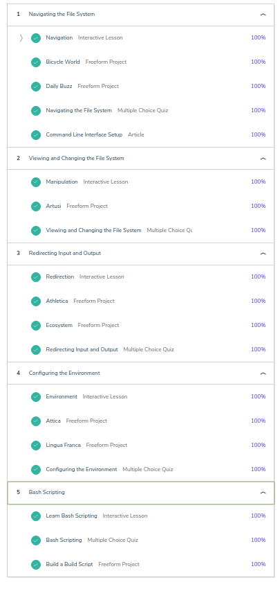

1.  [Learn the Command Line](https://www.codecademy.com/learn/learn-the-command-line)
2.  Read [HTTP: The Protocol Every Web Developer Must Know - Part 1](https://code.tutsplus.com/tutorials/http-the-protocol-every-web-developer-must-know-part-1--net-31177)
3.  Read [HTTP: The Protocol Every Web Developer Must Know - Part 2](https://code.tutsplus.com/tutorials/http-the-protocol-every-web-developer-must-know-part-2--net-31155)
4.  Create README.md for the task_linux_cli
5. My impressions about learned materials:
* We can do loops and conditionals and arrays in the Bash!!!
6. [codecademy profile](https://www.codecademy.com/profiles/corobox) and screenshot: 

